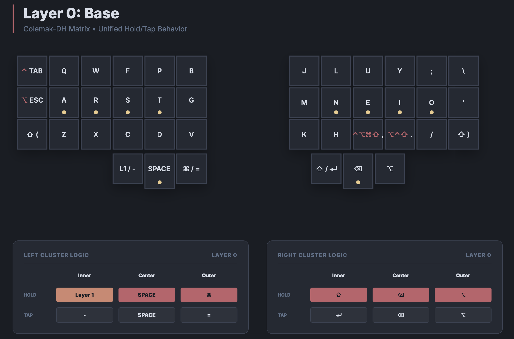
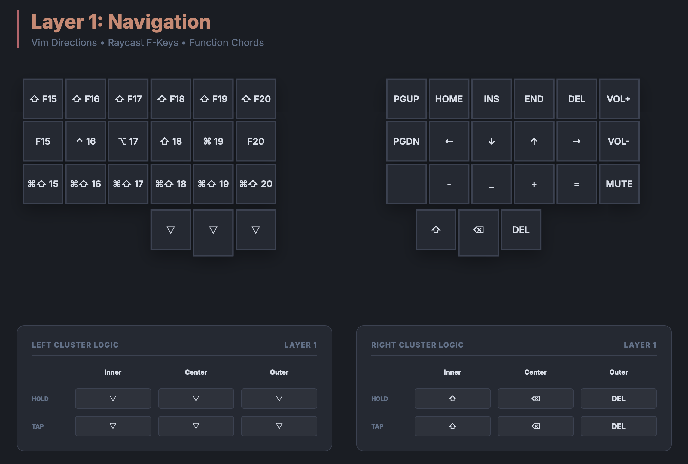
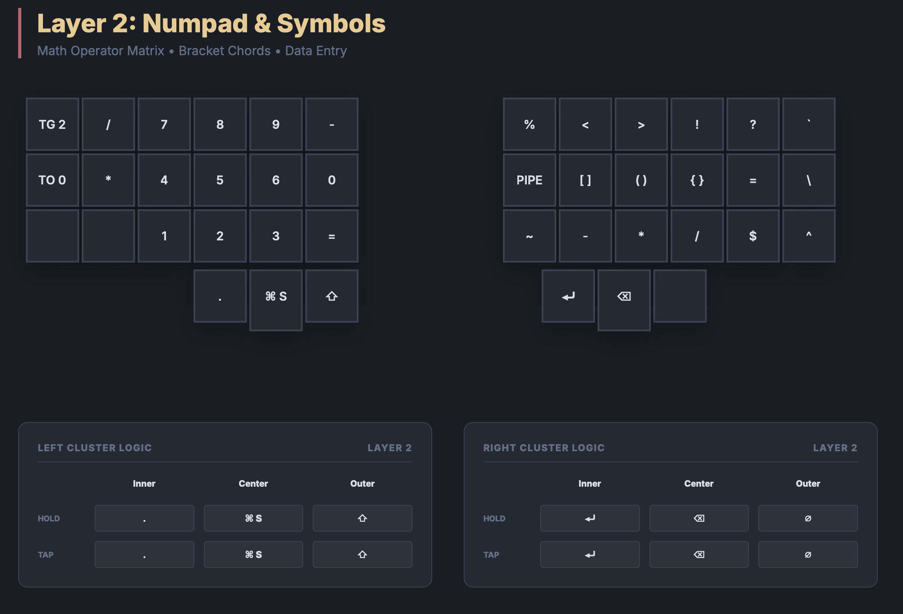
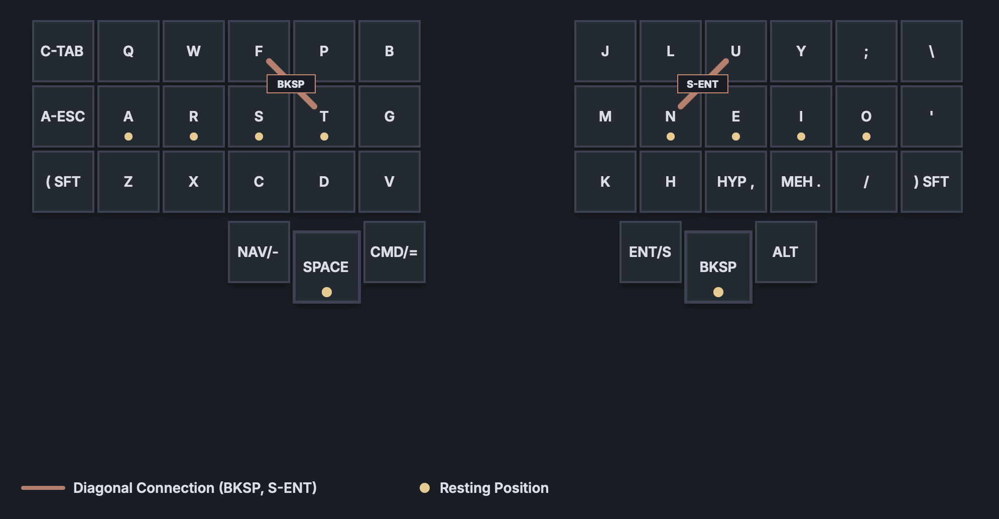

# Unicorne Pure QMK Keymap

Custom Colemak-DH keymap for the Boardsource Unicorne using pure QMK firmware (no Vial).

## Keymap Visualizations







*Color scheme: [Nordic.nvim](https://github.com/AlexvZyl/nordic.nvim)*

---

## Design Philosophy

1. **Pure Space** - Dedicated `KC_SPC` on left thumb for zero-latency typing
2. **Space Cadet** - `SC_LSPO`/`SC_RSPC` for parentheses on shift keys
3. **Merged Productivity Layer** - Numpad on left, symbols on right for one-handed data entry
4. **Mod-Tap Thumbs** - `-`/`=` on tap, Nav/Cmd on hold
5. **Key Overrides** - Bracket pairs condensed: `[`/`]`, `(`/`)`, `{`/`}` via Shift
6. **Selective Auto Shift** - Disabled for alpha, numbers, comma, period

## Hardware

| Property | Value |
|----------|-------|
| Keyboard | Boardsource Unicorne |
| Layout | Split 3x6 + 3 thumb keys |
| MCU | RP2040 |
| Bootloader | RP2040 (double-tap reset) |

### Hardware Specifications

The chording efficiency of this layout relies on specific low-profile hardware to allow for seamless vertical slides and "between-key" presses.

| Component | Model | Notes |
|-----------|-------|-------|
| Case | [Unicorne LP Aluminum Case](https://boardsource.xyz/products/unicorne-lp-aluminum-corne-case) | Premium, rigid enclosure for high-speed chording stability |
| Switches | [Ambients Silent Choc](https://lowprokb.ca/products/ambients-silent-choc-switches) | Linear, silent low-profile. Low actuation force reduces pinky fatigue |
| Keycaps | [Blank MBK Profile](https://boardsource.xyz/products/blank-mbk) | Uniform, scooped PBT. Tight spacing essential for vertical chording |

---

## Features

| Feature | Status | Notes |
|---------|--------|-------|
| OLED Display | Enabled | |
| Encoder | Enabled | |
| Bootmagic | Enabled | |
| NKRO | Enabled | |
| Extrakeys | Enabled | |
| RGB Matrix | Enabled | Off by default (val=0), 54 LEDs |
| Combos | Enabled | 11 code-defined combos |
| Key Overrides | Enabled | Bracket pair mappings |
| Caps Word | Enabled | 5s idle timeout |
| Auto Shift | Enabled | Custom whitelist: ; ' / - = |
| Space Cadet | Enabled | SC_LSPO/SC_RSPC for parentheses |
| Mousekeys | **Disabled** | |
| Audio | **Disabled** | No hardware installed |
| Pointing Device | **Disabled** | Causes mouse drift without joystick |

---

## Keymap

### Layer 0: Base (Colemak-DH)

*Optimized for speed. Pure Space. Smart Shift/Layer Thumb.*

```
       Left Hand                                               Right Hand
┌─────────┬─────────┬─────────┬─────────┬─────────┬─────────┐   ┌─────────┬─────────┬─────────┬─────────┬─────────┬─────────┐
│LCTL(TAB)│  KC_Q   │  KC_W   │  KC_F   │  KC_P   │  KC_B   │   │  KC_J   │  KC_L   │  KC_U   │  KC_Y   │ KC_SCLN │ KC_BSLS │
├─────────┼─────────┼─────────┼─────────┼─────────┼─────────┤   ├─────────┼─────────┼─────────┼─────────┼─────────┼─────────┤
│LALT(ESC)│  KC_A   │  KC_R   │  KC_S   │  KC_T   │  KC_G   │   │  KC_M   │  KC_N   │  KC_E   │  KC_I   │  KC_O   │ KC_QUOT │
├─────────┼─────────┼─────────┼─────────┼─────────┼─────────┤   ├─────────┼─────────┼─────────┼─────────┼─────────┼─────────┤
│ SC_LSPO │  KC_Z   │  KC_X   │  KC_C   │  KC_D   │  KC_V   │   │  KC_K   │  KC_H   │HYPR(,)  │ MEH(.)  │ KC_SLSH │ SC_RSPC │
└─────────┴─────────┴─────────┼─────────┼─────────┼─────────┤   ├─────────┼─────────┼─────────┴─────────┴─────────┴─────────┘
                              │LT(NAV,-)│ KC_SPC  │LGUI(=)  │   │RSFT(ENT)│LT(SYM,BS)│RALT(NO)│
                              └─────────┴─────────┴─────────┘   └─────────┴─────────┴─────────┘
```

**Thumb Cluster:**
```
       LEFT THUMBS (Control)                         RIGHT THUMBS (Actions)
   (Outer        Mid        Inner)              (Inner         Mid         Outer)
┌────────────┬────────────┬────────────┐      ┌────────────┬────────────┬────────────┐
│ TAP: -     │ TAP: Space │ TAP: =     │      │ TAP: Enter │ TAP: Bksp  │ TAP: --    │
├────────────┼────────────┼────────────┤      ├────────────┼────────────┼────────────┤
│ HLD: Nav   │ HLD: --    │ HLD: Cmd   │      │ HLD: Shift │ HLD: Sym   │ HLD: Alt   │
└────────────┴────────────┴────────────┘      └────────────┴────────────┴────────────┘
```

**Key Details:**
- `LCTL_T(KC_TAB)`: Tap = Tab, Hold = Control
- `LALT_T(KC_ESC)`: Tap = Esc, Hold = Alt
- `SC_LSPO`: Tap = `(`, Hold = Shift (Space Cadet)
- `SC_RSPC`: Tap = `)`, Hold = Shift (Space Cadet)
- `HYPR_T(KC_COMM)`: Tap = `,`, Hold = Hyper (Ctrl+Alt+Shift+Cmd)
- `MEH_T(KC_DOT)`: Tap = `.`, Hold = Meh (Ctrl+Alt+Shift)
- `LT(_NAV, KC_MINS)`: Tap = `-`, Hold = Navigation layer
- `KC_SPC`: Pure space (no layer-tap delay)
- `LGUI_T(KC_EQL)`: Tap = `=`, Hold = Cmd
- `RSFT_T(KC_ENT)`: Tap = Enter, Hold = Right Shift
- `LT(_SYM, KC_BSPC)`: Tap = Backspace, Hold = Symbols layer
- `RALT_T(KC_NO)`: Hold = Alt, Tap = nothing

---

### Layer 1: Navigation & Raycast

*Left: Raycast F-keys with modifiers. Right: Navigation.*

```
       Left Hand (Raycast & Mods)                              Right Hand (Navigation)
┌──────────┬──────────┬──────────┬──────────┬──────────┬──────────┐   ┌──────────┬──────────┬──────────┬──────────┬──────────┬──────────┐
│ S(KC_F15)│ S(KC_F16)│ S(KC_F17)│ S(KC_F18)│ S(KC_F19)│ S(KC_F20)│   │ KC_PGUP  │ KC_HOME  │  KC_INS  │  KC_END  │  KC_DEL  │ KC_VOLU  │
├──────────┼──────────┼──────────┼──────────┼──────────┼──────────┤   ├──────────┼──────────┼──────────┼──────────┼──────────┼──────────┤
│  KC_F15  │LCTL_T(16)│LALT_T(17)│LSFT_T(18)│LGUI_T(19)│  KC_F20  │   │ KC_PGDN  │ KC_LEFT  │ KC_DOWN  │  KC_UP   │ KC_RGHT  │ KC_VOLD  │
├──────────┼──────────┼──────────┼──────────┼──────────┼──────────┤   ├──────────┼──────────┼──────────┼──────────┼──────────┼──────────┤
│G(S(F15)) │G(S(F16)) │G(S(F17)) │G(S(F18)) │G(S(F19)) │G(S(F20)) │   │ XXXXXXX  │ KC_MINS  │S(KC_MINS)│ KC_PLUS  │ KC_EQL   │ KC_MUTE  │
└──────────┴──────────┴──────────┼──────────┼──────────┼──────────┤   ├──────────┼──────────┼──────────┴──────────┴──────────┴──────────┘
                                 │ _______  │ _______  │ _______  │   │ KC_LSFT  │ KC_BSPC  │  KC_DEL  │
                                 └──────────┴──────────┴──────────┘   └──────────┴──────────┴──────────┘
```

**Thumb Cluster:**
```
       LEFT THUMBS (Transparent)                    RIGHT THUMBS
   (Outer        Mid        Inner)              (Inner         Mid         Outer)
┌────────────┬────────────┬────────────┐      ┌────────────┬────────────┬────────────┐
│ TAP: -     │ TAP: Space │ TAP: =     │      │ TAP: Shift │ TAP: Bksp  │ TAP: Del   │
├────────────┼────────────┼────────────┤      ├────────────┼────────────┼────────────┤
│ HLD: Nav   │ HLD: --    │ HLD: Cmd   │      │ HLD: Shift │ HLD: --    │ HLD: --    │
└────────────┴────────────┴────────────┘      └────────────┴────────────┴────────────┘
```

**Notes:**
- Left thumbs are transparent (`_______`) - inherit from Layer 0
- Home row mods on F16-F19 for modifier access
- `S(KC_Fxx)` = Shift+F-key (Raycast shortcuts)
- `G(S(KC_Fxx))` = Cmd+Shift+F-key (Raycast alternate)
- Right side: Full navigation cluster with Page Up/Down, Home/End
- Bottom row right: `-` (minus), `_` (underscore), `+`, `=`

---

### Layer 2: Numbers & Symbols

*Triggered by Right Middle Thumb Hold (`LT(_SYM, KC_BSPC)`). Left: Numpad. Right: Symbols with Key Overrides.*

```
       Left Hand (Numpad)                                      Right Hand (Math & Logic)
┌──────────┬──────────┬──────────┬──────────┬──────────┬──────────┐   ┌──────────┬──────────┬──────────┬──────────┬──────────┬──────────┐
│  TG(2)   │ KC_SLSH  │  KC_P7   │  KC_P8   │  KC_P9   │ KC_MINS  │   │ KC_PERC  │ KC_LABK  │ KC_RABK  │ KC_EXLM  │ KC_QUES  │ KC_GRV   │
├──────────┼──────────┼──────────┼──────────┼──────────┼──────────┤   ├──────────┼──────────┼──────────┼──────────┼──────────┼──────────┤
│ TO(_BASE)│ KC_ASTR  │  KC_P4   │  KC_P5   │  KC_P6   │ KC_P0    │   │ KC_PIPE  │ KC_LBRC  │ KC_LPRN  │ KC_LCBR  │ KC_EQL   │ KC_BSLS  │
├──────────┼──────────┼──────────┼──────────┼──────────┼──────────┤   ├──────────┼──────────┼──────────┼──────────┼──────────┼──────────┤
│ XXXXXXX  │ XXXXXXX  │  KC_P1   │  KC_P2   │  KC_P3   │ KC_EQL   │   │ KC_TILD  │ KC_MINS  │ KC_ASTR  │ KC_SLSH  │ KC_DLR   │ KC_CIRC  │
└──────────┴──────────┴──────────┼──────────┼──────────┼──────────┤   ├──────────┼──────────┼──────────┴──────────┴──────────┴──────────┘
                                 │ KC_PDOT  │G(KC_SPC) │ KC_LSFT  │   │  KC_ENT  │ KC_BSPC  │ _______  │
                                 └──────────┴──────────┴──────────┘   └──────────┴──────────┴──────────┘
```

**Thumb Cluster:**
```
       LEFT THUMBS                                   RIGHT THUMBS
   (Outer        Mid        Inner)              (Inner         Mid         Outer)
┌────────────┬────────────┬────────────┐      ┌────────────┬────────────┬────────────┐
│ TAP: .     │ TAP: ⌘Spc  │ TAP: Shift │      │ TAP: Enter │ TAP: Bksp  │ TAP: OSM   │
├────────────┼────────────┼────────────┤      ├────────────┼────────────┼────────────┤
│ HLD: --    │ HLD: --    │ HLD: Shift │      │ HLD: --    │ HLD: --    │ HLD: --    │
└────────────┴────────────┴────────────┘      └────────────┴────────────┴────────────┘
```

**Key Details:**
- `KC_PDOT`: Numpad decimal point
- `G(KC_SPC)`: Cmd+Space (Spotlight/Raycast)
- `KC_LSFT`: Left Shift for quick number capitalization
- Right thumbs: Direct keys (no hold behavior on this layer)

**Notes:**
- `TG(_SYM)`: Toggle layer lock for extended numpad use
- `TO(_BASE)`: Return to base layer
- Left: Calculator-style numpad (7-8-9 / 4-5-6 / 1-2-3 / 0)
- Right: Programming symbols, brackets with Key Override pairs

---

## Combos

| Keys | Output | Type | Description |
|------|--------|------|-------------|
| **Left Hand** ||||
| W + R | `KC_ESC` | Vertical | Escape (Ring) |
| F + S | `KC_TAB` | Vertical | Tab (Middle) |
| F + P | `KC_DEL` | Horizontal | Delete (Top row) |
| X + C | `G(KC_Z)` | Horizontal | Undo (Bottom row) |
| C + D | `G(KC_Y)` | Horizontal | Redo (Bottom row) |
| D + V | `G(S(KC_V))` | Horizontal | Paste without format |
| F + T | `KC_BSPC` | Diagonal | Backspace |
| **Right Hand** ||||
| U + E | `S(KC_BSLS)` | Vertical | Pipe `\|` (Middle) |
| Y + I | `KC_GRV` | Vertical | Backtick `` ` `` (Ring) |
| L + N | `CW_TOGG` | Vertical | Caps Word Toggle (Middle) |
| N + U | `S(KC_ENT)` | Diagonal | Shift + Enter |

---

## Key Overrides

Bracket pairs use Key Overrides - hold Shift to get closing bracket:

| Key | Tap | Shift + Tap |
|-----|-----|-------------|
| `KC_LBRC` | `[` | `]` |
| `KC_LPRN` | `(` | `)` |
| `KC_LCBR` | `{` | `}` |

---

## Auto Shift

Hold these keys (150ms) to get their shifted version:

| Key | Tap | Hold |
|-----|-----|------|
| `;` | `;` | `:` |
| `'` | `'` | `"` |
| `/` | `/` | `?` |
| `-` | `-` | `_` |
| `=` | `=` | `+` |

**Excluded:** Alpha, numeric, brackets, comma, period.

---

## Ergonomics & Finger Mapping

### Resting Positions (Home Row)

- **Left Hand:** Thumb on `Space`, Index on `T`, Middle on `S`, Ring on `R`, Pinky on `A`
- **Right Hand:** Thumb on `Backspace`, Index on `N`, Middle on `E`, Ring on `I`, Pinky on `O`

### Finger-to-Key Mapping

| Hand | Finger | Keys Accessed |
|------|--------|---------------|
| **Left** | **Thumb** | All left thumb cluster (`NAV/-`, `SPC`, `CMD/=`) |
| | **Index** | `P`, `T`, `B`, `G`, `D`, `V` |
| | **Middle** | `F`, `S`, `C` |
| | **Ring** | `W`, `R`, `X`, `Q`, `CTRL-TAB` |
| | **Pinky** | `A`, `Z`, `LSFT/(`, `ALT-ESC` |
| **Right** | **Thumb** | All right thumb cluster (`SFT-ENT`, `SYM-BKSP`, `ALT`) |
| | **Index** | `J`, `M`, `K`, `L`, `N`, `H` |
| | **Middle** | `U`, `E`, `,` (HYPER) |
| | **Ring** | `Y`, `I`, `.` (MEH), `;`, `\` |
| | **Pinky** | `O`, `/`, `'`, `RSFT/)` |

---

## Build & Flash

To use this keymap:

1. Clone this repo or copy `qmk/` files to your QMK installation:
   ```
   keyboards/boardsource/unicorne/keymaps/<your_name>/
   ```

2. Build:
   ```bash
   qmk compile -kb boardsource/unicorne -km <your_name>
   ```

3. Flash:
   - Double-tap RESET button on keyboard
   - Drag `.uf2` file to the RPI-RP2 drive

---

## Repository Structure

```
unicorne-keymap/
├── README.md       # This file
├── CHANGELOG.md    # Version history
├── images/         # Keymap visualizations
│   ├── layer-0-base.png
│   ├── layer-1-nav.png
│   ├── layer-2-sym.png
│   ├── combos-horizontal-vertical.png
│   └── combos-diagonal.png
└── qmk/            # QMK source files
    ├── keymap.c    # Keymap + Combos + Key Overrides
    ├── config.h    # Feature configuration
    └── rules.mk    # Build flags
```
