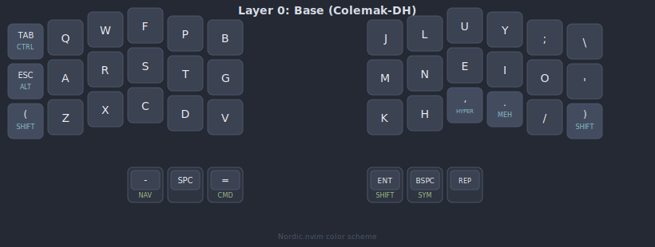
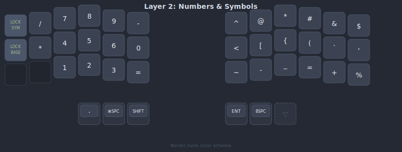
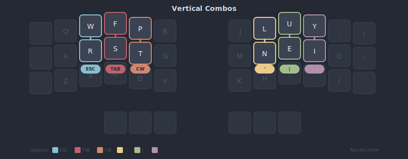
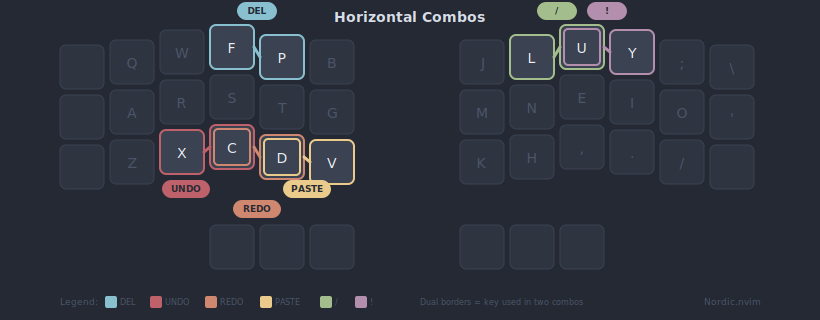
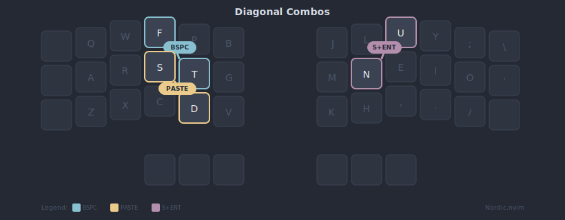

# qmk-unicorne-colemak-dh

Custom Colemak-DH keymap for the Boardsource Unicorne using pure QMK firmware (no Vial).

*Color scheme: [Nordic.nvim](https://github.com/AlexvZyl/nordic.nvim)*

---

## Design Philosophy

1. **Pure Space** - Dedicated `KC_SPC` on left thumb for zero-latency typing
2. **Space Cadet** - `SC_LSPO`/`SC_RSPC` for parentheses on shift keys
3. **Merged Productivity Layer** - Numpad on left, symbols on right for one-handed data entry
4. **Mod-Tap Thumbs** - `-`/`=` on tap, Nav/Cmd on hold
5. **Key Overrides** - Bracket pairs condensed: `[`/`]`, `(`/`)`, `{`/`}` via Shift
6. **Selective Auto Shift** - Disabled for alpha, numbers, comma, period

## Hardware

| Property | Value |
|----------|-------|
| Keyboard | Boardsource Unicorne |
| Layout | Split 3x6 + 3 thumb keys |
| MCU | RP2040 |
| Bootloader | RP2040 (double-tap reset) |

### Hardware Specifications

The chording efficiency of this layout relies on specific low-profile hardware to allow for seamless vertical slides and "between-key" presses.

| Component | Model | Notes |
|-----------|-------|-------|
| Case | [Unicorne LP Aluminum Case](https://boardsource.xyz/products/unicorne-lp-aluminum-corne-case) | Premium, rigid enclosure for high-speed chording stability |
| Switches | [Ambients Silent Choc](https://lowprokb.ca/products/ambients-silent-choc-switches) | Linear, silent low-profile. Low actuation force reduces pinky fatigue |
| Keycaps | [Blank MBK Profile](https://boardsource.xyz/products/blank-mbk) | Uniform, scooped PBT. Tight spacing essential for vertical chording |

---

## Features

| Feature | Status | Notes |
|---------|--------|-------|
| OLED Display | Enabled | |
| Encoder | Enabled | |
| Bootmagic | Enabled | |
| NKRO | Enabled | |
| Extrakeys | Enabled | |
| RGB Matrix | Enabled | Off by default (val=0), 54 LEDs |
| Combos | Enabled | 15 code-defined combos |
| Key Overrides | Enabled | Bracket pair mappings |
| Caps Word | Enabled | 5s idle timeout |
| Auto Shift | Enabled | Custom whitelist: ; ' / - = |
| Space Cadet | Enabled | SC_LSPO/SC_RSPC for parentheses |
| Repeat Key | Enabled | QK_REP on right outer thumb |
| Select Word | Enabled | SELWORD, SELWBAK, SELLINE on Nav layer |
| Mousekeys | **Disabled** | |
| Audio | **Disabled** | No hardware installed |
| Pointing Device | **Disabled** | Causes mouse drift without joystick |

---

## Keymap

### Layer 0: Base (Colemak-DH)



*Optimized for speed. Pure Space. Smart Shift/Layer Thumb. Repeat Key on outer right.*

```
       Left Hand                                               Right Hand
┌─────────┬─────────┬─────────┬─────────┬─────────┬─────────┐   ┌─────────┬─────────┬─────────┬─────────┬─────────┬─────────┐
│LCTL(TAB)│  KC_Q   │  KC_W   │  KC_F   │  KC_P   │  KC_B   │   │  KC_J   │  KC_L   │  KC_U   │  KC_Y   │ KC_SCLN │ KC_BSLS │
├─────────┼─────────┼─────────┼─────────┼─────────┼─────────┤   ├─────────┼─────────┼─────────┼─────────┼─────────┼─────────┤
│LALT(ESC)│  KC_A   │  KC_R   │  KC_S   │  KC_T   │  KC_G   │   │  KC_M   │  KC_N   │  KC_E   │  KC_I   │  KC_O   │ KC_QUOT │
├─────────┼─────────┼─────────┼─────────┼─────────┼─────────┤   ├─────────┼─────────┼─────────┼─────────┼─────────┼─────────┤
│ SC_LSPO │  KC_Z   │  KC_X   │  KC_C   │  KC_D   │  KC_V   │   │  KC_K   │  KC_H   │HYPR(,)  │ MEH(.)  │ KC_SLSH │ SC_RSPC │
└─────────┴─────────┴─────────┼─────────┼─────────┼─────────┤   ├─────────┼─────────┼─────────┴─────────┴─────────┴─────────┘
                              │LGUI(=)  │ KC_SPC  │LT(NAV,-)│   │RSFT(ENT)│LT(SYM,BS)│ QK_REP  │
                              └─────────┴─────────┴─────────┘   └─────────┴─────────┴─────────┘
```

**Thumb Cluster:**
```
       LEFT THUMBS (Control)                         RIGHT THUMBS (Actions)
   (Outer        Mid        Inner)              (Inner         Mid         Outer)
┌────────────┬────────────┬────────────┐      ┌────────────┬────────────┬────────────┐
│ TAP: =     │ TAP: Space │ TAP: -     │      │ TAP: Enter │ TAP: Bksp  │ TAP: Repeat│
├────────────┼────────────┼────────────┤      ├────────────┼────────────┼────────────┤
│ HLD: Cmd   │ HLD: --    │ HLD: Nav   │      │ HLD: Shift │ HLD: Sym   │ HLD: --    │
└────────────┴────────────┴────────────┘      └────────────┴────────────┴────────────┘
```

**Key Details:**
- `LCTL_T(KC_TAB)`: Tap = Tab, Hold = Control
- `LALT_T(KC_ESC)`: Tap = Esc, Hold = Alt
- `SC_LSPO`: Tap = `(`, Hold = Shift (Space Cadet)
- `SC_RSPC`: Tap = `)`, Hold = Shift (Space Cadet)
- `HYPR_T(KC_COMM)`: Tap = `,`, Hold = Hyper (Ctrl+Alt+Shift+Cmd)
- `MEH_T(KC_DOT)`: Tap = `.`, Hold = Meh (Ctrl+Alt+Shift)
- `LGUI_T(KC_EQL)`: Tap = `=`, Hold = Cmd
- `KC_SPC`: Pure space (no layer-tap delay)
- `LT(_NAV, KC_MINS)`: Tap = `-`, Hold = Navigation layer
- `RSFT_T(KC_ENT)`: Tap = Enter, Hold = Right Shift
- `LT(_SYM, KC_BSPC)`: Tap = Backspace, Hold = Symbols layer
- `QK_REP`: Repeat last key (no hold function)

---

### Layer 1: Navigation & System Orchestrator


*Left: System Orchestrator F-keys with modifiers. Right: Navigation + Select Word.*

```
       Left Hand (System Orchestrator & Mods)                  Right Hand (Navigation + Select Word)
┌──────────┬──────────┬──────────┬──────────┬──────────┬──────────┐   ┌──────────┬──────────┬──────────┬──────────┬──────────┬──────────┐
│ S(KC_F15)│ S(KC_F16)│ S(KC_F17)│ S(KC_F18)│ S(KC_F19)│ S(KC_F20)│   │ KC_PGUP  │ SELWBAK  │ SELWORD  │ SELLINE  │  KC_END  │ KC_VOLU  │
├──────────┼──────────┼──────────┼──────────┼──────────┼──────────┤   ├──────────┼──────────┼──────────┼──────────┼──────────┼──────────┤
│  KC_F15  │LCTL_T(16)│LALT_T(17)│LSFT_T(18)│LGUI_T(19)│  KC_F20  │   │ KC_PGDN  │ KC_LEFT  │ KC_DOWN  │  KC_UP   │ KC_RGHT  │ KC_VOLD  │
├──────────┼──────────┼──────────┼──────────┼──────────┼──────────┤   ├──────────┼──────────┼──────────┼──────────┼──────────┼──────────┤
│G(S(F15)) │G(S(F16)) │G(S(F17)) │G(S(F18)) │G(S(F19)) │G(S(F20)) │   │ KC_HOME  │ KC_MINS  │ KC_UNDS  │  KC_EQL  │ KC_PLUS  │ KC_MUTE  │
└──────────┴──────────┴──────────┼──────────┼──────────┼──────────┤   ├──────────┼──────────┼──────────┴──────────┴──────────┴──────────┘
                                 │ _______  │ _______  │ _______  │   │ KC_LSFT  │ KC_BSPC  │ QK_AREP  │
                                 └──────────┴──────────┴──────────┘   └──────────┴──────────┴──────────┘
```

**Thumb Cluster:**
```
       LEFT THUMBS (Transparent)                    RIGHT THUMBS
   (Outer        Mid        Inner)              (Inner         Mid         Outer)
┌────────────┬────────────┬────────────┐      ┌────────────┬────────────┬────────────┐
│ TAP: -     │ TAP: Space │ TAP: =     │      │ TAP: Shift │ TAP: Bksp  │ TAP: AltRep│
├────────────┼────────────┼────────────┤      ├────────────┼────────────┼────────────┤
│ HLD: Nav   │ HLD: --    │ HLD: Cmd   │      │ HLD: Shift │ HLD: --    │ HLD: --    │
└────────────┴────────────┴────────────┘      └────────────┴────────────┴────────────┘
```

**Notes:**
- Left thumbs are transparent (`_______`) - inherit from Layer 0
- Home row mods on F16-F19 for modifier access
- `S(KC_Fxx)` = Shift+F-key (System Orchestrator shortcuts)
- `G(S(KC_Fxx))` = Cmd+Shift+F-key (System Orchestrator alternate)
- Right side: Navigation cluster with Page Up/Down, Home/End
- Top row: Select Word keys (SELWBAK, SELWORD, SELLINE)
- Bottom row right: `-` (minus), `_` (underscore), `=`, `+` (matches Layer 2)
- `QK_AREP`: Alt Repeat - outputs contextual alternate of last key

---

### Layer 2: Numbers & Symbols



*Triggered by Right Middle Thumb Hold (`LT(_SYM, KC_BSPC)`). Left: Normal numbers. Right: Programming symbols with Key Overrides.*

```
       Left Hand (Numbers)                                     Right Hand (Symbols)
┌──────────┬──────────┬──────────┬──────────┬──────────┬──────────┐   ┌──────────┬──────────┬──────────┬──────────┬──────────┬──────────┐
│ DF(_SYM) │ KC_SLSH  │  KC_7    │  KC_8    │  KC_9    │ KC_MINS  │   │ KC_CIRC  │  KC_AT   │ KC_ASTR  │ KC_HASH  │ KC_AMPR  │ KC_DLR   │
├──────────┼──────────┼──────────┼──────────┼──────────┼──────────┤   ├──────────┼──────────┼──────────┼──────────┼──────────┼──────────┤
│DF(_BASE) │ KC_ASTR  │  KC_4    │  KC_5    │  KC_6    │  KC_0    │   │ KC_LABK  │ KC_LBRC  │ KC_LCBR  │ KC_LPRN  │ KC_GRV   │ KC_QUOT  │
├──────────┼──────────┼──────────┼──────────┼──────────┼──────────┤   ├──────────┼──────────┼──────────┼──────────┼──────────┼──────────┤
│ XXXXXXX  │ XXXXXXX  │  KC_1    │  KC_2    │  KC_3    │ KC_EQL   │   │ KC_TILD  │ KC_MINS  │ KC_UNDS  │ KC_EQL   │ KC_PLUS  │ KC_PERC  │
└──────────┴──────────┴──────────┼──────────┼──────────┼──────────┤   ├──────────┼──────────┼──────────┴──────────┴──────────┴──────────┘
                                 │ KC_DOT   │G(KC_SPC) │ KC_LSFT  │   │  KC_ENT  │ KC_BSPC  │ _______  │
                                 └──────────┴──────────┴──────────┘   └──────────┴──────────┴──────────┘
```

**Thumb Cluster:**
```
       LEFT THUMBS                                   RIGHT THUMBS
   (Outer        Mid        Inner)              (Inner         Mid         Outer)
┌────────────┬────────────┬────────────┐      ┌────────────┬────────────┬────────────┐
│ TAP: .     │ TAP: ⌘Spc  │ TAP: Shift │      │ TAP: Enter │ TAP: Bksp  │ TAP: --    │
├────────────┼────────────┼────────────┤      ├────────────┼────────────┼────────────┤
│ HLD: --    │ HLD: --    │ HLD: Shift │      │ HLD: --    │ HLD: --    │ HLD: --    │
└────────────┴────────────┴────────────┘      └────────────┴────────────┴────────────┘
```

**Key Details:**
- `KC_DOT`: Normal decimal point (not numpad)
- `G(KC_SPC)`: Cmd+Space (Spotlight/System Orchestrator)
- `KC_LSFT`: Left Shift for quick symbol access
- Right thumbs: Direct keys (no hold behavior on this layer)

**Notes:**
- `DF(_SYM)`: Sets Symbol layer as **default** (persists after releasing LT thumb)
- `DF(_BASE)`: Return to base layer as default
- Left: Normal numbers 0-9 (not numpad codes)
- Right: Programming symbols with Key Override brackets
- **Key Override:** Shift + `<` outputs `>` (angle brackets)

---

## Combos







| Keys | Output | Type | Description |
|------|--------|------|-------------|
| **Left Hand** ||||
| W + R | `KC_ESC` | Vertical | Escape (Ring) |
| F + S | `KC_TAB` | Vertical | Tab (Middle) |
| P + T | `CW_TOGG` | Vertical | Caps Word Toggle (Index) |
| F + P | `KC_DEL` | Horizontal | Delete (Top row) |
| X + C | `G(KC_Z)` | Horizontal | Undo (Bottom row) |
| C + D | `G(KC_Y)` | Horizontal | Redo (Bottom row) |
| D + V | `G(S(KC_V))` | Horizontal | Paste without format (Cmd+Shift+V) |
| W + F | `G(KC_M)` | Diagonal | Minimize window (Cmd+M) |
| F + T | `KC_BSPC` | Diagonal | Backspace |
| **Right Hand** ||||
| U + E | `S(KC_BSLS)` | Vertical | Pipe `\|` (Middle) |
| Y + I | `KC_GRV` | Vertical | Backtick `` ` `` (Ring) |
| L + N | `KC_QUOT` | Vertical | Apostrophe `'` (Index) |
| L + U | `KC_SLSH` | Horizontal | Slash `/` (Top row) |
| U + Y | `KC_EXLM` | Horizontal | Exclamation `!` (Top row) |
| N + U | `S(KC_ENT)` | Diagonal | Shift + Enter |

---

## Key Overrides

Bracket pairs and angle brackets use Key Overrides - hold Shift to get closing/opposite bracket:

| Key | Tap | Shift + Tap |
|-----|-----|-------------|
| `KC_LBRC` | `[` | `]` |
| `KC_LPRN` | `(` | `)` |
| `KC_LCBR` | `{` | `}` |
| `KC_LABK` | `<` | `>` |

---

## Auto Shift

Hold these keys (150ms) to get their shifted version:

| Key | Tap | Hold |
|-----|-----|------|
| `;` | `;` | `:` |
| `'` | `'` | `"` |
| `/` | `/` | `?` |
| `-` | `-` | `_` |
| `=` | `=` | `+` |

**Excluded:** Alpha, numeric, brackets, comma, period.

---

## Repeat Key & Alt Repeat

The Repeat Key feature enables efficient key repetition:

| Key | Location | Function |
|-----|----------|----------|
| `QK_REP` | Layer 0, Right outer thumb | Repeats the last pressed key |
| `QK_AREP` | Layer 1, Right outer thumb | Outputs contextual alternate |

**Examples of Alt Repeat:**
- After `n` → `N` (capitalize)
- After `(` → `)` (close bracket)
- After `.` → `/` (common sequence)

---

## Select Word

Pascal Getreuer's Select Word feature for efficient text selection:

| Key | Function | Behavior |
|-----|----------|----------|
| `SELWORD` | Select word | Selects word at cursor; tap again to extend |
| `SELWBAK` | Select backward | Selects word to the left of cursor |
| `SELLINE` | Select line | Selects entire line |

**Configuration:**
- Uses macOS hotkeys (`SELECT_WORD_OS_MAC`)
- 2-second timeout for extending selections

**Location:** All three keys are on Layer 1 top row (SELWBAK, SELWORD, SELLINE).

---

## Ergonomics & Finger Mapping

### Resting Positions (Home Row)

- **Left Hand:** Thumb on `Space`, Index on `T`, Middle on `S`, Ring on `R`, Pinky on `A`
- **Right Hand:** Thumb on `Backspace`, Index on `N`, Middle on `E`, Ring on `I`, Pinky on `O`

### Finger-to-Key Mapping

| Hand | Finger | Keys Accessed |
|------|--------|---------------|
| **Left** | **Thumb** | All left thumb cluster (`NAV/-`, `SPC`, `CMD/=`) |
| | **Index** | `P`, `T`, `B`, `G`, `D`, `V` |
| | **Middle** | `F`, `S`, `C` |
| | **Ring** | `W`, `R`, `X`, `Q`, `CTRL-TAB` |
| | **Pinky** | `A`, `Z`, `LSFT/(`, `ALT-ESC` |
| **Right** | **Thumb** | All right thumb cluster (`SFT-ENT`, `SYM-BKSP`, `ALT`) |
| | **Index** | `J`, `M`, `K`, `L`, `N`, `H` |
| | **Middle** | `U`, `E`, `,` (HYPER) |
| | **Ring** | `Y`, `I`, `.` (MEH), `;`, `\` |
| | **Pinky** | `O`, `/`, `'`, `RSFT/)` |

---

## Build & Flash

```bash
# Build firmware (from QMK root)
make boardsource/unicorne:default

# Output: boardsource_unicorne_default.uf2

# Flash:
# 1. Double-tap RESET button
# 2. Drag .uf2 to RPI-RP2 drive
```

